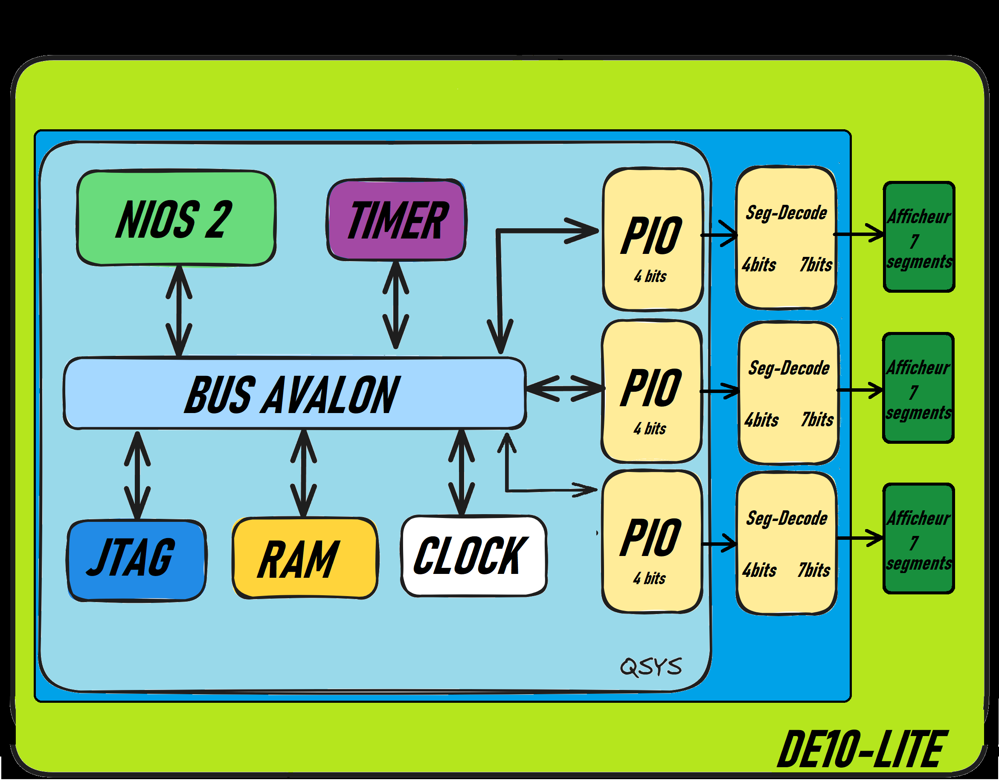

# albouquet_lab2

## Introduction

Le lab2 est un projet VHDL couplé au Softcore NIOS2.
Il a pour but de réaliser un compteur (allant de 0 à 999), à l'aide d'afficheur 7-segments, sur la carte DE10-lite.
Un programme en .c permet de gérer l'incrémentation du compteur, le décodage des unités, dizaine et cetaine, et l'envoie sur les 3 afficheurs.

## Partie VHDL

* Un processeur NIOS II, une mémoire (40K octets), et un peripherique JTAG sont ajoutés.
* Trois IP PIO (4 bits chacuns) sont ajoutés pour récupérer la valeur du compteur, sur 4 bits pour chaque digit.
* L'IP seg_decode permet de transcrire chacune de ces valeurs sur 7 bits, pour l'affichage sur afficheur 7-segments.
* Un timer est implémenté pour envoyer une interruption toutes les secondes afin d'incrémenter le compteur au bon moment.

## Partie programme C : 

Ce programme permet d'incrémenter le compteur.
Ensuite, grâce à des opérateurs de type modulo, la récupération de chacun des 3 digits est réalisée.
Ces digits sont envoyés sur les PIOs correspondants afin d'être affichés par les afficheurs 7-segments.

De plus, un timer est configuré (via Qsys) sur 1 seconde, et géré grâce à la fonction interrupt_handler().
Cette fonction place une variable global à 1 afin d'indiquer au programme principal qu'il faut incrémenter le compteur.

## Fonctionnement sur la carte :

Le reset de la carte provoque l'incrémentation automatique du compteur.
Arrivé à 999, le compteur repart de 0.